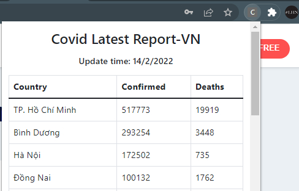
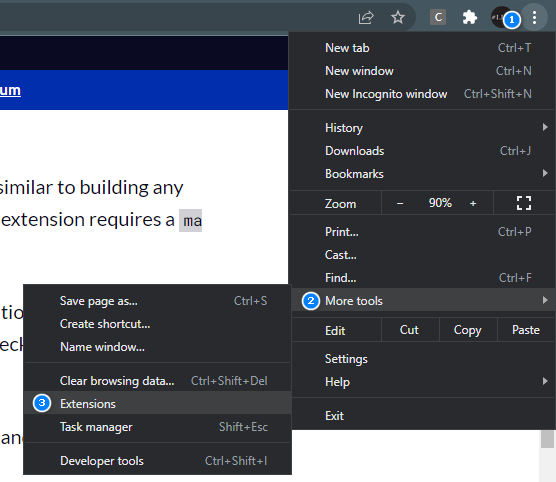
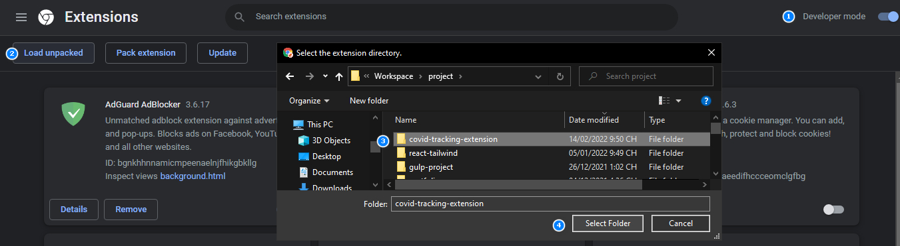

<h1 align="center">
Covid-19 Stats VN - Tiện ích hiển thị tình hình covid-19 ở Việt Nam
</h1>

### 📝 Giới thiệu về Project
---
<div align="center">
  
</div>

<br />


### ✨ Tính năng

- Extension Hiển thị thông tin covid-19 trên các tỉnh thành ở Việt Nam

### ⚙ Cài đặt

1. Clone project này

```
  git clone https://github.com/nhim411/extension-covid-report
```

2. Cài đặt Extension cho trình duyệt Chrome
- Chọn More Tools -> Extensions
- Mở Developer mode, chọn Loaded unpacked và trỏ về thư mục vừa clone
<div align="center">
  
  

</div>
<br />
3. Chạy Extension từ trình duyệt

---

### 📞 Liên hệ

<br />

<div align="center">
<a href="mailto:lehoainam1998@gmail.com" target="_blank"></a>
<a href="https://fb.com/lhnam411" target="_blank"></a>
<a href="https://www.linkedin.com/in/nhim411/" target="_blank"></a>
</div>
<br />